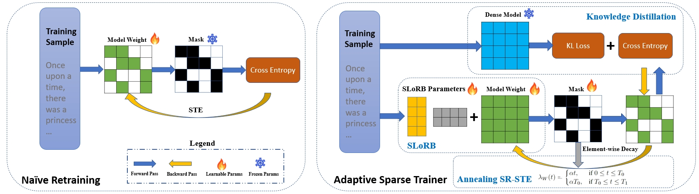

# Adaptive Sparse Trainer

Official implementation for ["Pruning Large Language Models with Semi-Structural Adaptive Sparse Training"](https://arxiv.org/abs/2407.20584) accepted at AAAI 2025.

## Abstract

Adaptive Sparse Trainer is a pipline for retraining sparse LLMs. It can reduces the perplexity and zero-shot accuracy gap between dense and 2:4 semi-structured sparse models to 0.6 and 1.16\%, respectively, utilizing less than 0.4\% of the pretraining tokens and GPU hours.


## Installation

```
pip install torch numpy transformers datasets tiktoken wandb tqdm
```

Dependencies:

- [pytorch](https://pytorch.org) <3
- [numpy](https://numpy.org/install/) <3
-  `transformers` for huggingface transformers <3 (to load GPT-2 checkpoints)
-  `datasets` for huggingface datasets <3 (if you want to download + preprocess OpenWebText)
-  `tiktoken` for OpenAI's fast BPE code <3
-  `wandb` for optional logging <3
-  `tqdm` for progress bars <3

## Data Preparation

We use C4 dataset to train our models and use wikitext to evaluate. For preparing c4 dataset, first download raw datafiles from [Huggingface](https://huggingface.co/datasets/allenai/c4/tree/main/en) and run

```
$ python data/c4_dataset/prepare.py
```

This creates a `train.bin` and `val.bin` in that data directory. 

For Wikitext dataset download from [Huggingface](https://huggingface.co/datasets/Salesforce/wikitext/tree/main/wikitext-2-raw-v1) and place it under data/cwikitext.


## Model Preparation

Simply download the GPT2 model weights from Huggingface and put it under gpt2 folder


## Training Examples

To train sparse models with Wanda Metric first run 

```
$ python prepare_calibration_data.py 
```

This create a calibration dataset for calculating if you are using magnitude metric, this step can be skipped.

To reproduce naive retraining run

```
$ torchrun --nproc_per_node=8 main.py \
    --learning_rate 2e-4 \
    --min_lr 2e-5 \
    --warmup_iters 2000 \
    --lr_decay_iters 38000 \
    --max_iters 40000 \
    --batch_size 8\
    --global_batch_size 128\
    --mode sparse_forward\
    --mask_type structured\
    --mask_metric 'magnitude'\
```

To reproduce our methods run

```
$ torchrun --nproc_per_node=2 main.py \
    --srste_decay 1e-4  \
    --learning_rate 2e-4 \
    --min_lr 2e-5 \
    --teacher_model 'gpt2' \
    --student_model 'gpt2' \
    --warmup_iters 2000 \
    --lr_decay_iters 38000 \
    --increase_step' 10000 \
    --max_iters 40000 \
    --batch_size 8\
    --global_batch_size 128\
    --mask_metric 'magnitude'\
    --mode sparse_forward\
    --change_mask True\
    --mask_type structured\
    --SLoRB True \
    --SLoRB_init_type "mean"\
    --SLoRB_k 16 \
    --trainable_projection True\
    --distill_model True \
    --hardness_task 0.33 \
    --hardness_kldiv 0.67 \
    --hardness_squarehead 0.0  \
    --gradient_checkpointing True \
```


## LLaMA2 Model Weights

To Be Released.

## Results

| Method                        | Training       | 125M   | 350M   | 1.3B   | 124M   | 350M   | 774M   | 1.5B   |
|-------------------------------|----------------|--------|--------|--------|--------|--------|--------|--------|
| Dense                         | -              | 27.76  | 22.00  | 14.62  | 29.95  | 21.72  | 19.43  | 17.40  |
| SparseGPT                     | ✗              | 45.58  | 40.33  | 29.03  | 50.09  | 31.03  | 25.98  | 21.14  |
| Wanda                     | ✗              | 60.91  | 50.16  | 23.92  | 115.64 | 63.71  | 49.97  | 30.44  |
| Iterative Magnitude Pruning   | ✓              | 38.37  | 30.29  | 23.94  | 40.08  | 29.86  | 24.31  | 20.83  |
| Gradual Magnitude Pruning | ✓              | 31.51  | 25.98  | 16.78  | 33.48  | 24.83  | 22.01  | 18.96  |
| **AST-Naive (Ours)**              | ✓              | 30.22  | 24.65  | 15.85  | 32.23  | 23.65  | 21.29  | 18.33  |
| **AST-Boosted (Ours)**        | ✓              | **28.68** | **24.03** | **15.43** | **31.13** | **23.03** | **20.66** | **18.01** |


| Models (Sparsity Pattern)       | Parameters | BoolQ  | RTE    | HellaSwag | WinoGrande | ARC-e  | ARC-c  | OBQA   | Mean   |
|---------------------------------|------------|--------|--------|-----------|------------|--------|--------|--------|--------|
| LLaMA2-7B (Dense)               | 6.7B       | 77.73  | 63.89  | 57.18     | 69.04      | 76.17  | 42.91  | 31.60  | 59.78  |
| Sheared-LLaMA-2.7B (Dense)      | 2.7B       | 65.99  | 50.54  | 51.21     | 65.03      | 67.29  | 33.27  | 28.80  | 51.73  |
| INCITE-Base-3B (Dense)          | 2.8B       | 67.40  | 52.34  | 47.91     | 62.98      | 67.68  | 31.74  | 27.60  | 51.09  |
| Open-LLaMA-3B-v2 (Dense)        | 3.4B       | 65.89  | 55.69  | 52.12     | 63.59      | 68.34  | 34.32  | 26.00  | 52.13  |
| Wanda LLaMA-7B (Sparse)               | 3.4B       | **73.21**  | 61.34  | **54.86**     | 66.18      | 70.24  | 35.68  | **31.80** | 56.19  |
| LLaMA2-7B (Sparse)              | 3.4B       | **73.12**  | **66.06** | **54.66**  | **67.87**      | **73.61**  | **39.93**  | 28.60  | **57.68**  |


## Acknowledgements

This repo is modified from [nanoGPT library](https://github.com/karpathy/nanoGPT). We thanks the authors of nanoGPT for their easy-to-use training script!
